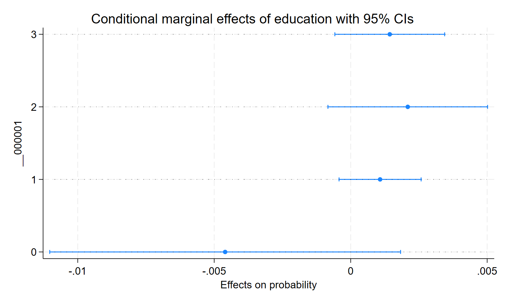

# 1. Logit Model of Transport Choice

Let $y_i = 1$ if traveller $i$ chooses air transport and $y_i = 0$ if she chooses train. Let $x_i$ be a $K$-element vector of traveller and trip characteristics. We observe $N$ independent realisations of $(y_i, x_i)$.

## (a) MLE: Derivation, Asymptotic Variance, and Estimation

Since $y_i$ is Bernoulli, its conditional distribution is:

$$
y_i = \begin{cases} 1 & \text{with probability } P(y_i = 1 \mid x_i) \\ 0 & \text{with probability } 1 - P(y_i = 1 \mid x_i) \end{cases}
$$

We model $P(y_i = 1 \mid x_i) = F(x_i'\beta)$, so the regression is $y_i = F(x_i'\beta) + u_i$ with $\mathbb{E}[u_i \mid x_i] = 0$. Choosing $F$ to be the logistic CDF $\Lambda$ restricts fitted probabilities to $(0,1)$ and gives the logit model:

$$
P(y_i = 1 \mid x_i) = \Lambda(x_i'\beta) = \frac{e^{x_i'\beta}}{1 + e^{x_i'\beta}}
$$

Under random sampling, the likelihood is:

$$
L = \prod_{i=1}^N \left[\Lambda(x_i'\beta)\right]^{y_i}\left[1 - \Lambda(x_i'\beta)\right]^{1-y_i}
$$

Taking logs:

$$
\ell = \sum_{i=1}^N \left\{ y_i \ln\Lambda(x_i'\beta) + (1-y_i)\ln\left[1 - \Lambda(x_i'\beta)\right] \right\}
$$

The FOC $\frac{\partial\ell}{\partial\beta} = 0$ gives:

$$
\sum_{i=1}^N \frac{y_i - \Lambda(x_i'\beta)}{\Lambda(x_i'\beta)(1-\Lambda(x_i'\beta))} \Lambda'(x_i'\beta)\, x_i = 0
$$

For the logistic CDF, $\Lambda'(x_i'\beta) = \Lambda(x_i'\beta)(1 - \Lambda(x_i'\beta))$, so the FOCs simplify to:

$$
\sum_{i=1}^N \left(y_i - \Lambda(x_i'\beta)\right)x_i = 0
$$

This is nonlinear in $\beta$ and has no closed-form solution. In practice $\hat{\beta}$ is found via numerical optimization (Newton-Raphson or BFGS).

**Asymptotic variance.** Using a mean value expansion of the score around the true $\beta_0$:

$$
0 = \ell_\beta(\hat{\beta}) = \ell_\beta(\beta_0) + \ell_{\beta\beta'}(\beta^*)(\hat{\beta} - \beta_0)
$$

where $\beta^*$ lies between $\hat{\beta}$ and $\beta_0$. Rearranging and scaling by $\sqrt{N}$:

$$
\sqrt{N}(\hat{\beta} - \beta_0) = -\left[\frac{1}{N}\ell_{\beta\beta'}(\beta^*)\right]^{-1}\left[\frac{1}{\sqrt{N}}\ell_\beta(\beta_0)\right]
$$

* By consistency of $\hat{\beta}$ and the LLN and CMT: $-\left(\frac{1}{N}\ell_{\beta\beta'}(\beta^*)\right)^{-1} \xrightarrow{p} (-A_0)^{-1}$, where $A_0 = \mathbb{E}[\ell_{i,\beta\beta'}(\beta_0)]$.
* By the CLT: $\frac{1}{\sqrt{N}}\ell_\beta(\beta_0) \xrightarrow{d} \mathcal{N}(0, B_0)$, where $B_0 = \mathbb{E}[\ell_{i,\beta}(\beta_0)\ell_{i,\beta}(\beta_0)']$.

By Slutsky's theorem:

$$
\sqrt{N}(\hat{\beta} - \beta_0) \xrightarrow{d} \mathcal{N}(0,\, A_0^{-1}B_0A_0^{-1})
$$

Under correct model specification, the **Information Matrix Equality** holds: $-A_0 = B_0$, so the variance simplifies to $(-A_0)^{-1} = B_0^{-1}$:

$$
\sqrt{N}(\hat{\beta} - \beta_0) \xrightarrow{d} \mathcal{N}(0,\, B_0^{-1})
$$

**Estimation.** A consistent estimator of $B_0^{-1}$ is the outer product of gradients (OPG):

$$
\widehat{\text{A}\mathbb{V}\text{ar}}(\hat{\beta}) = \frac{1}{N}\left[\frac{1}{N}\sum_{i=1}^N \left(y_i - \Lambda(x_i'\hat{\beta})\right)^2 x_ix_i'\right]^{-1}
$$

The OPG estimator is always positive semi-definite in finite samples, unlike the Hessian-based alternative which can fail to be so.

## (b) Coefficient Signs, Fare Change, Confidence Interval, and Hypothesis Tests

The index is $x_i'\beta = \beta_0 + \beta_1\Delta c_i + \beta_2\Delta t_i + \beta_3\text{hinc}_i$, where $\Delta c_i = c_{\text{air}} - c_{\text{train}}$ and $\Delta t_i = t_{\text{air}} - t_{\text{train}}$.

The marginal effect of $x_{ij}$ on the choice probability is:

$$
\frac{\partial P(y_i=1 \mid x_i)}{\partial x_{ij}} = \underbrace{\Lambda(x_i'\beta)(1-\Lambda(x_i'\beta))}_{\geq 0} \cdot \beta_j
$$

so the sign of $\beta_j$ determines the direction of the effect.

### (i) Signs and Fare Offset (Model 1)

Both $\hat{\beta}_1 = -0.961$ and $\hat{\beta}_2 = -0.131$ are negative. This is plausible: as air travel becomes more expensive or slower relative to train, the probability of choosing air decreases. An increase in relative air cost or time reduces the utility of air travel and shifts choices toward train.

To keep the choice probability unchanged when $\Delta(\Delta t_i) = +1$ hour:

$$
\beta_1\,\Delta(\Delta c_i) + \beta_2\,\Delta(\Delta t_i) = 0
$$

$$
-0.961\,\Delta(\Delta c_i) - 0.131\,(1) = 0 \implies \Delta(\Delta c_i) = -\frac{0.131}{0.961} \approx -0.1363
$$

Since $\Delta c_i$ is measured in hundreds of dollars, the air fare must fall by approximately **\$13.63** to offset a one-hour increase in travel time.

### (ii) Approximate 95% Confidence Interval for $\beta_2$ (Model 1)

$$
\hat{\beta}_2 \pm z_{0.025} \cdot \widehat{SE}(\hat{\beta}_2) = -0.131 \pm 1.96 \times 0.055 = [-0.239,\ -0.023]
$$

The interval is "approximate" in two senses: (1) the asymptotic normality of $\hat{\beta}$ is a large-sample result, and (2) the standard error is itself estimated from the data. With only 121 observations the normal approximation may be unreliable.

### (iii) One-Sided Wald Test of $H_0: \beta_1 = 0$ vs. $H_1: \beta_1 < 0$ (Model 1)

$$
z = \frac{\hat{\beta}_1 - 0}{\widehat{SE}(\hat{\beta}_1)} = \frac{-0.961}{0.765} = -1.256
$$

At size $\alpha = 0.05$, the one-sided critical value is $z_{0.05} = -1.645$. Since $-1.256 > -1.645$, the test statistic does not fall in the rejection region. We fail to reject $H_0$: there is no statistically significant evidence that $\beta_1 < 0$ at the 5% level.

### (iv) Likelihood Ratio Test of $H_0: \beta_1 = 0$ (Models 2 vs. 3)

Model 3 imposes $\beta_1 = 0$ relative to the unrestricted Model 2. The LR statistic is:

$$
LR = 2(\ell_{\text{unrestricted}} - \ell_{\text{restricted}}) = 2(-270.53 - (-270.85)) = 2(0.32) = 0.64
$$

Under $H_0$, $LR \xrightarrow{d} \chi^2_1$. The 5% critical value is $\chi^2_{1,0.05} = 3.84$. Since $0.64 < 3.84$, we fail to reject $H_0$. The restricted Model 3 is preferred: once income and travel time are controlled for, the cost differential adds no significant explanatory power.

---

# 2. Censored Regression (Upper Censoring)

The latent variable is $y_i^* = x_i'\beta + \epsilon_i$ with $\epsilon_i \sim \mathcal{N}(0, \sigma^2)$, censored from above at known $U$:

$$
y_i = \begin{cases} y_i^* & \text{if } y_i^* < U \\ U & \text{if } y_i^* \geq U \end{cases}
$$

## (a) Log-Likelihood

Define $d_i = \mathbf{1}[y_i < U]$. The contributions to the likelihood are:

* **Uncensored** ($d_i = 1$, $y_i < U$): $y_i \sim \mathcal{N}(x_i'\beta, \sigma^2)$, so the density is $\frac{1}{\sigma}\phi\!\left(\frac{y_i - x_i'\beta}{\sigma}\right)$.
* **Censored** ($d_i = 0$, $y_i = U$): $P(y_i^* \geq U \mid x_i) = 1 - \Phi\!\left(\frac{U - x_i'\beta}{\sigma}\right)$.

Under random sampling:

$$
L = \prod_{i=1}^N \left[\frac{1}{\sigma}\phi\!\left(\frac{y_i - x_i'\beta}{\sigma}\right)\right]^{d_i} \left[1 - \Phi\!\left(\frac{U - x_i'\beta}{\sigma}\right)\right]^{1-d_i}
$$

Taking logs:

$$
\ell = \sum_{i=1}^N \left\{ d_i\left[-\frac{1}{2}\ln(2\pi) - \ln\sigma - \frac{(y_i - x_i'\beta)^2}{2\sigma^2}\right] + (1-d_i)\ln\left[1 - \Phi\!\left(\frac{U - x_i'\beta}{\sigma}\right)\right] \right\}
$$

## (b) Truncated Mean $\mathbb{E}[y_i \mid x_i, y_i < U]$

$$
\mathbb{E}[y_i \mid x_i, y_i < U] = \mathbb{E}[x_i'\beta + \epsilon_i \mid \epsilon_i < U - x_i'\beta]
= x_i'\beta + \mathbb{E}[\epsilon_i \mid \epsilon_i < U - x_i'\beta]
$$

Multiplying through by $\sigma/\sigma$ and using the standard normal truncation formula:

$$
\mathbb{E}[y_i \mid x_i, y_i < U] = x_i'\beta + \sigma\,\mathbb{E}\!\left[\frac{\epsilon_i}{\sigma} \;\Big|\; \frac{\epsilon_i}{\sigma} < \frac{U - x_i'\beta}{\sigma}\right] = x_i'\beta - \sigma\,\frac{\phi\!\left(\frac{U - x_i'\beta}{\sigma}\right)}{\Phi\!\left(\frac{U - x_i'\beta}{\sigma}\right)}
$$

Letting $\lambda_i = \frac{\phi\!\left(\frac{U - x_i'\beta}{\sigma}\right)}{\Phi\!\left(\frac{U - x_i'\beta}{\sigma}\right)}$ denote the (upper-censored) inverse Mills ratio:

$$
\mathbb{E}[y_i \mid x_i, y_i < U] = x_i'\beta - \sigma\lambda_i
$$

## (c) Heckman's Two-Step Estimator

**Step 1.** Model the censoring indicator with Probit. Since $P(d_i = 1 \mid x_i) = \Phi\!\left(\frac{U - x_i'\beta}{\sigma}\right) = \Phi(x_i'\gamma)$ where $\gamma = -\beta/\sigma$ (up to a sign convention), estimate $\hat{\gamma}$ by MLE. Use $\hat{\gamma}$ to compute the estimated inverse Mills ratio $\hat{\lambda}_i$ for each observation.

**Step 2.** Using only the uncensored observations ($y_i < U$), run OLS of $y_i$ on $x_i$ and $\hat{\lambda}_i$:

$$
y_i = x_i'\beta - \sigma\hat{\lambda}_i + v_i
$$

This gives consistent estimates of $\beta$ and $\sigma$ in large samples. One practical issue: the inverse Mills ratio can be nearly linear in $x_i'\hat{\gamma}$ over a limited range of covariate values, causing near-multicollinearity with $x_i$ and inflating standard errors. The standard errors from Step 2 OLS also need to be corrected for the first-stage estimation, since $\hat{\lambda}_i$ is a generated regressor.

## (d) Censored Mean $\mathbb{E}[y_i \mid x_i]$

The censored mean weights the uncensored and censored parts by their respective probabilities:

$$
\mathbb{E}[y_i \mid x_i] = P(d_i = 0 \mid x_i)\cdot U + P(d_i = 1 \mid x_i)\cdot\mathbb{E}[y_i \mid x_i, y_i < U]
$$

Substituting $P(d_i = 1) = \Phi\!\left(\frac{U - x_i'\beta}{\sigma}\right)$, $P(d_i = 0) = 1 - \Phi\!\left(\frac{U - x_i'\beta}{\sigma}\right)$, and the truncated mean from (b):

$$
\mathbb{E}[y_i \mid x_i] = U\left[1 - \Phi\!\left(\frac{U - x_i'\beta}{\sigma}\right)\right] + \Phi\!\left(\frac{U - x_i'\beta}{\sigma}\right)x_i'\beta - \sigma\,\phi\!\left(\frac{U - x_i'\beta}{\sigma}\right)
$$

---

# 3. Multinomial Models: Number of Children

## (a) Multinomial Logit

We use a **multinomial logit** rather than a conditional logit. The regressor of interest, `education`, varies across individuals but is the same regardless of which fertility outcome we are considering; it is individual-specific and alternative-invariant. Conditional logit is designed for regressors that vary across alternatives (e.g., the price of each alternative), which is not the case here.

Stata normalizes the lowest outcome category, which here is 0 children (zero kids), as the base. All coefficients are interpreted relative to this base.

A coefficient of $0.0484$ on education for the "2 children" outcome means that one additional year of education increases the log-odds of having two children versus zero by $0.0484$. For 12 versus 0 years of education, the log-odds difference is $0.0484 \times 12 = 0.5808$, corresponding to a relative risk ratio of $\exp(0.5808) \approx 1.787$. So a person with 12 years of education is approximately **1.79 times more likely** to have two children than zero, relative to a person with no education.



## (b) Average Marginal Effects

The average marginal effect (AME) of education on outcome $j$ is:

$$
\text{AME}_j = \frac{1}{N}\sum_{i=1}^N \frac{\partial P(y_i = j \mid x_i)}{\partial \text{education}_i}
$$

In practice, we compute the predicted probabilities for each individual, increment education by a small amount $h = 0.0001$, recompute the predicted probabilities, and take the numerical derivative $(p^{\text{new}} - p)/h$ averaged across all individuals.

A key constraint is that the four AMEs must sum to zero across all outcomes for each individual:

$$
\sum_{j=0}^{3} \frac{\partial P(y_i = j \mid x_i)}{\partial x_i} = \frac{\partial}{\partial x_i}\sum_{j=0}^{3} P(y_i = j \mid x_i) = \frac{\partial}{\partial x_i}(1) = 0
$$

An increase in the probability of any one outcome must be offset by decreases elsewhere. The table below confirms this: the four AMEs sum to essentially zero.



## (c) Ordered Probit

An ordered probit is more appropriate here than multinomial logit. The number of children is **ordinal**: 0, 1, 2, 3 are naturally ordered, and imposing this structure gives more efficient estimates and imposes meaningful restrictions (the IIA assumption of multinomial logit is also avoided).

The latent variable is $y_i^* = \beta\,\text{educ}_i + u_i$ with $u_i \sim \mathcal{N}(0,1)$. The observed outcome is determined by three estimated thresholds $\hat{\alpha}_1 < \hat{\alpha}_2 < \hat{\alpha}_3$:

$$
y_i = \begin{cases} 0 & y_i^* \leq \alpha_1 \\ 1 & \alpha_1 < y_i^* \leq \alpha_2 \\ 2 & \alpha_2 < y_i^* \leq \alpha_3 \\ 3 & y_i^* > \alpha_3 \end{cases}
$$

The implied probabilities are:

$$
\begin{aligned}
P(y_i = 0 \mid x_i) &= \Phi(\alpha_1 - x_i'\beta) \\
P(y_i = 1 \mid x_i) &= \Phi(\alpha_2 - x_i'\beta) - \Phi(\alpha_1 - x_i'\beta) \\
P(y_i = 2 \mid x_i) &= \Phi(\alpha_3 - x_i'\beta) - \Phi(\alpha_2 - x_i'\beta) \\
P(y_i = 3 \mid x_i) &= 1 - \Phi(\alpha_3 - x_i'\beta)
\end{aligned}
$$

**Threshold interpretation.** With $\hat{\alpha}_1 = 0.386$, $\hat{\alpha}_2 = 0.913$, $\hat{\alpha}_3 = 1.690$:

* $\hat{\alpha}_1 = 0.386$: the cutpoint separating 0 and 1 child. Individuals whose latent index $y_i^*$ falls at or below 0.386 are predicted to have no children.
* $\hat{\alpha}_2 = 0.913$: the cutpoint separating 1 and 2 children. A latent index between 0.386 and 0.913 corresponds to one child.
* $\hat{\alpha}_3 = 1.690$: the cutpoint separating 2 and 3 children. A latent index between 0.913 and 1.690 corresponds to two children, and above 1.690 to three or more.

**Education coefficient.** Since $\hat{\beta}_{\text{educ}} = 0.0119 > 0$, higher education shifts $y_i^*$ upward. This decreases the probability of lower outcomes (zero or one child) and increases the probability of higher outcomes (two or three children), without requiring a separate coefficient for each outcome transition.

**Marginal effect at education = 12.** The marginal effect on $P(y_i = 2)$ evaluated at $\text{educ}_i = 12$ is:

$$
\frac{\partial P(y_i = 2 \mid \text{educ}_i = 12)}{\partial\,\text{educ}_i} = \left[\phi(\hat{\alpha}_2 - 12\hat{\beta}) - \phi(\hat{\alpha}_3 - 12\hat{\beta})\right]\hat{\beta} \approx 0.00209
$$

One additional year of education at the 12-year level increases the probability of having two children by approximately **0.209 percentage points**.







---

# Stata Code

```{stata}
#| eval: false

// Problem Set 3: Multinomial Models //
cd "C:\Users\T14\7Programming\STATA\02Classes\01EconometricsII\Problem_Sets\PS03"
use "soep_lebensz_en.dta", clear

* Panel data: keep only first observation per individual for cross-sectional MLE
sort id year
by id: gen obs_no = _n
keep if obs_no == 1


// --- Q3(a): Multinomial Logit ---
mlogit no_kids education
estimates store mlogit1

esttab mlogit1 using "mlogit1.tex", replace tex ///
    main(b) se parentheses nonumbers ///
    star(* 0.10 ** 0.05 *** 0.01) ///
    title("Multinomial Logit Regression on Education")


// --- Q3(b): Average Marginal Effects ---

* Built-in method
quietly mlogit no_kids education, baseoutcome(0)
margins, dydx(education) post

esttab using "mlogit_ame.tex", replace tex ///
    main(b) se parentheses star(* 0.10 ** 0.05 *** 0.01) ///
    rename(1._predict 0_kids 2._predict 1_kid 3._predict 2_kids 4._predict 3_kids) ///
    title("Average Marginal Effects of Education on No. of Kids") ///
    nonumbers

* Manual method (numerical derivative)
quietly mlogit no_kids education, baseoutcome(0)
predict p1 p2 p3 p4

summarize p1 p2 p3 p4   // compare to sample proportions
tab no_kids

replace education = education + 0.0001
predict p1new p2new p3new p4new

gen dp1dy = 10000*(p1new - p1)
gen dp2dy = 10000*(p2new - p2)
gen dp3dy = 10000*(p3new - p3)
gen dp4dy = 10000*(p4new - p4)

sum dp1dy dp2dy dp3dy dp4dy


// --- Q3(c): Ordered Probit ---
oprobit no_kids education
estimates store oprobit1

esttab oprobit1 using "oprobit.tex", replace tex ///
    mtitles("Ordered Probit") ///
    main(b) se parentheses nonumbers ///
    star(* 0.10 ** 0.05 *** 0.01)

* AME across all education values
margins, dydx(*)

* AME at education = 12
margins, dydx(education) at(education=12) post
estimates store oprobit_ame_12

esttab oprobit_ame_12 using "oprobit_ame.tex", replace tex ///
    main(b) se parentheses star(* 0.10 ** 0.05 *** 0.01) ///
    rename(1._predict 0_kids 2._predict 1_kid 3._predict 2_kids 4._predict 3_kids) ///
    title("Average Marginal Effects of Education at 12 Years") ///
    nonumbers

* Visualize
marginsplot, horizontal recast(dot)
```
