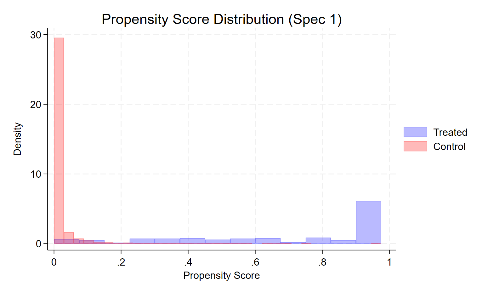

# 1. IV with Imperfect Compliance

Consider a setting where treatment $D_i \in \{0,1\}$ cannot be perfectly enforced. A researcher randomly assigns $Z_i \in \{0,1\}$, but compliance is imperfect so $D_i \neq Z_i$ for some individuals. The structural model is:

$$
Y_i = \beta_0 + \beta_{1i}D_i + U_i, \qquad D_i = \pi_0 + \pi_{1i}Z_i + V_i
$$

where $\beta_{1i}$ and $\pi_{1i}$ are random coefficients, independent of $Z_i$.

## (a) Homogeneous Compliance: IV Estimates the ATE

Suppose $\pi_{1i} = \pi_1$ is fixed (homogeneous compliance). The IV (Wald) estimand is:

$$
\hat{\beta}^{IV} = \frac{\text{Cov}(Z_i, Y_i)}{\text{Cov}(Z_i, D_i)}
$$

**Numerator.** Substituting the structural equation for $Y_i$:

$$
\text{Cov}(Z_i, Y_i) = \text{Cov}(Z_i,\, \beta_0 + \beta_{1i}D_i + U_i) = \mathbb{E}[\beta_{1i}D_i Z_i] - \mathbb{E}[\beta_{1i}D_i]\mathbb{E}[Z_i]
$$

Substituting $D_i = \pi_0 + \pi_1 Z_i + V_i$ and using $\mathbb{E}[Z_i U_i] = \mathbb{E}[Z_i V_i] = 0$ (instrument exogeneity):

$$
\text{Cov}(Z_i, Y_i) = \mathbb{E}[\beta_{1i}(\pi_0 + \pi_1 Z_i + V_i)Z_i] - \mathbb{E}[\beta_{1i}(\pi_0 + \pi_1 Z_i + V_i)]\mathbb{E}[Z_i]
$$

$$
= \pi_1\,\text{Var}(Z_i)\,\mathbb{E}[\beta_{1i}] + \pi_1\,\text{Cov}(\beta_{1i}, V_i)\,\mathbb{E}[Z_i]
$$

Since $\beta_{1i} \perp Z_i$ and $\mathbb{E}[Z_i V_i] = 0$, the second term vanishes, giving $\text{Cov}(Z_i, Y_i) = \pi_1\,\text{Var}(Z_i)\,\mathbb{E}[\beta_{1i}]$.

**Denominator.** $\text{Cov}(Z_i, D_i) = \text{Cov}(Z_i, \pi_0 + \pi_1 Z_i + V_i) = \pi_1\,\text{Var}(Z_i)$.

**Wald estimand:**

$$
\text{plim}\ \hat{\beta}^{IV} = \frac{\pi_1\,\text{Var}(Z_i)\,\mathbb{E}[\beta_{1i}]}{\pi_1\,\text{Var}(Z_i)} = \mathbb{E}[\beta_{1i}] = ATE \qquad \blacksquare
$$

## (b) Heterogeneous Compliance: WATE and LATE

When $\pi_{1i}$ is random, the denominator becomes $\text{Cov}(Z_i, D_i) = \mathbb{E}[\pi_{1i}]\,\text{Var}(Z_i)$. The numerator requires more care:

$$
\text{Cov}(Z_i, Y_i) = \mathbb{E}[\beta_{1i}\pi_{1i}]\,\text{Var}(Z_i)
$$

so the Wald estimand becomes:

$$
\text{plim}\ \hat{\beta}^{IV} = \frac{\mathbb{E}[\beta_{1i}\pi_{1i}]}{\mathbb{E}[\pi_{1i}]}
$$

This is a **weighted average treatment effect (WATE)**, where each individual's treatment effect $\beta_{1i}$ is weighted by their compliance $\pi_{1i}$. Individuals who respond more strongly to the instrument receive more weight. The WATE generally differs from the ATE unless $\beta_{1i}$ and $\pi_{1i}$ are independent.

**Additional assumption needed: monotonicity.** $Z_i = 1$ weakly increases $D_i$ for every individual: $D_i(1) \geq D_i(0)$ a.s. This rules out defiers.

Under monotonicity, the population can be partitioned into compliers ($D_i(1) = 1, D_i(0) = 0$), always-takers ($D_i(1) = D_i(0) = 1$), and never-takers ($D_i(1) = D_i(0) = 0$). Always-takers and never-takers have $\pi_{1i} = 0$ and contribute zero weight. The Wald estimand then recovers the **LATE**:

$$
\text{plim}\ \hat{\beta}^{IV} = \mathbb{E}[\beta_{1i} \mid \text{complier}] = LATE
$$

**When does IV under-/overestimate the ATE?**

* **Underestimation:** If treatment effects are larger for never-takers or always-takers than for compliers. A relevant example is job training programs: those who would take training regardless of assignment (always-takers) may benefit less from formal program training if they are already motivated and skilled. Compliers, who take training only when assigned, could have lower baseline ability and thus a smaller $\beta_{1i}$, giving $LATE < ATE$.

* **Overestimation:** If compliers have higher returns to treatment than the general population. In the NSW context: $Z_i$ is the random offer of the program; compliers are those who take training when offered but would not otherwise seek it. If this group has particularly high returns to job training (perhaps because they face more severe labor market constraints), then $LATE > ATE$.

---

# 2. LaLonde (1986): Propensity Score Matching

LaLonde (1986) evaluates the performance of non-experimental estimators by comparing their estimates of the NSW training program effect to the experimental benchmark. We use the `dw.dta` dataset, which combines the NSW experimental data with comparison groups drawn from the CPS and PSID.

**Variables:** `re78` (outcome: real earnings 1978), `treat` (treatment indicator), `re75`, `re74` (pre-program earnings), `age`, `age2`, `ed`, `nodeg`, `black`, `hisp`, `married`, and sample indicators `exp`, `cps`, `psid`.

## (a) Summary Statistics Across Subgroups

| Variable | CPS | PSID | NSW Control | Treated |
|:---------|----:|-----:|------------:|--------:|
| age      | 33.23 | 34.85 | 25.82 | 25.05 |
| ed       | 12.03 | 12.12 | 10.35 | 10.09 |
| black    | 0.07  | 0.25  | 0.84  | 0.83  |
| hisp     | 0.07  | 0.03  | 0.06  | 0.11  |
| married  | 0.71  | 0.87  | 0.19  | 0.15  |
| nodeg    | 0.30  | 0.31  | 0.71  | 0.83  |
| re74     | 14,017 | 19,429 | 2,096 | 2,107 |
| re75     | 13,651 | 19,063 | 1,532 | 1,267 |
| re78     | 14,847 | 21,554 | 6,349 | 4,555 |
| $N$      | 15,992 | 2,490 | 185 | 260 |



The key feature of the comparison is that the CPS and PSID control groups are very different from the NSW treated and control groups. The observational comparison groups are older, better educated, more likely to be married, have much higher pre-program earnings ($14k-19k vs. $1.3k-2.1k), and are predominantly white. The NSW treated group, by contrast, closely resembles the NSW experimental controls in all pre-treatment characteristics, as expected from randomization. Using the CPS or PSID as control groups would require regression or matching to account for these systematic differences.

## (b) OLS Regressions: Replicating Dehejia and Wahba (1999) Table 2

The experimental benchmark (NSW, no controls) is approximately **\$1,794** with a standard error of \$633, significant at the 5% level. All specifications using the NSW experimental sample yield consistent, significant positive effects around \$1,600-\$1,800.

Using the PSID as control group, the no-controls estimate is **-\$15,205**, wildly off the experimental benchmark. Conditioning on earnings controls brings the estimate closer to zero but it remains negative (B3: -\$582, B4: \$396), and none of the specifications recover the experimental estimate. The CPS behaves similarly: the no-controls estimate is **-\$8,498**, and adding earnings controls brings it close to zero but not to \$1,794. These results confirm LaLonde's critique: simple OLS using non-experimental comparison groups fails to recover the experimental ATT, even after conditioning on rich observables.







## (c) Propensity Score: Becker-Ichino Specification

Using the NSW treated / PSID control sample and the Becker-Ichino (2002) specification, the propensity score is estimated by logit on: `age`, `age2`, `ed`, `ed2`, `married`, `black`, `hisp`, `re74`, `re75`, `re742`, `re752`, `blackU74`, where `ed2 = ed^2`, `re742 = re74^2`, `re752 = re75^2`, `U74 = (re74 == 0)`, and `blackU74 = black * U74`. The simpler initial specification fails the balancing property, confirming that we need interactions and polynomial terms to achieve balance across blocks.

## (d) ATT: Nearest-Neighbor Matching

Using the Becker-Ichino specification (output 6.2), the nearest-neighbor ATT estimate is approximately **\$1,668** (SE $\approx$ \$1,149). This is much closer to the experimental benchmark (\$1,794) than any of the OLS estimates on the non-experimental samples. The matching procedure effectively constructs a valid counterfactual for the treated group by finding PSID observations with similar propensity scores, recovering the experimental result even though the raw comparison groups are very different.

## (e) Alternative Propensity Score Specification

The alternative specification (Lemma 1, Becker-Ichino 2002) drops `re74`, `re742`, `age2`, and `ed` while adding the interaction `re7475 = re74 * re75`. It satisfies the balancing property and yields an ATT of approximately **\$2,019** (SE $\approx$ \$907). Comparing to the first specification (\$1,668), the estimate is somewhat higher but both are in the neighborhood of the experimental benchmark.

Balancing the propensity score between treated and control units is important for two reasons. First, it ensures that within each block, the distribution of covariates is similar across treatment groups, so the CIA $Y_i^0 \perp D_i \mid p(X_i)$ is more plausibly satisfied. Second, it validates the use of the propensity score for matching: if the score does not balance covariates, it does not serve as a sufficient statistic for selection, and matching on it will not remove selection bias.

## (f) Propensity Score Histograms

The histograms show the distribution of estimated propensity scores for the NSW treated group and the PSID control group. The treated group has high propensity scores (concentrated above 0.4-0.5), while the PSID control group has very low scores (concentrated near zero). This lack of overlap (common support) is the visual counterpart of why OLS fails: the PSID and treated groups are so dissimilar that regression must extrapolate far out of sample. The common support restriction imposed by `pscore` drops PSID observations with propensity scores outside the range of the treated group, keeping only the most comparable controls. The small mass of PSID observations with moderate propensity scores is what drives the matching estimates.



## (g) Radius and Kernel Matching

The radius matching ATT (caliper = 0.0001) is approximately **-\$5,546** (SE $\approx$ \$4,707), which is very poor. With such a tight caliper, few PSID controls fall within the radius of treated observations, leading to either very few matches or an extremely noisy estimate. The kernel matching ATT is approximately **\$1,538** (SE $\approx$ \$918), close to the experimental benchmark and the nearest-neighbor estimates.

An advantage of radius and kernel matching over nearest-neighbor matching is that they use multiple controls per treated unit, reducing variance from using a single (potentially outlier) match. Kernel matching weights all controls within the common support by their distance to the treated unit, using information efficiently. Radius matching provides a transparent way to enforce common support by using only controls within a defined distance.

## (h) Overall Comparison and Conclusion



The main takeaway is that propensity score matching on a properly balanced score can replicate the experimental benchmark using only observational data. Nearest-neighbor and kernel matching both recover estimates in the range of \$1,500-\$2,000, consistent with the experimental \$1,794. This supports the Dehejia-Wahba (1999) reanalysis: once we control flexibly for selection into the program using matching, the non-experimental PSID data yields estimates close to the experiment. Radius matching with a very tight caliper fails due to insufficient common support, highlighting the importance of the overlap condition. The exercise illustrates both the potential and the limitations of matching: it works well when the common support is non-trivial and the propensity score is properly specified, but is sensitive to these choices.

---

# Stata Appendix

```{stata}
#| eval: false

// Problem Set 5: Selection & Matching //
cd "C:\Users\T14\7Programming\STATA\02Classes\01EconometricsII\Problem_Sets\PS05"
use "dw.dta", clear


// --- Q1: Summary statistics across subgroups ---
quietly eststo estcps:    estpost summarize age ed black hisp married nodeg re74 re75 re78 if cps == 1
quietly eststo estpsid:   estpost summarize age ed black hisp married nodeg re74 re75 re78 if psid == 1
quietly eststo estshow:   estpost summarize age ed black hisp married nodeg re74 re75 re78 if treat == 1 & exp == 1
quietly eststo estnoshow: estpost summarize age ed black hisp married nodeg re74 re75 re78 if treat == 0 & exp == 1

esttab estcps estpsid estnoshow estshow using "q1_var_means.tex", replace tex ///
    cells("mean(fmt(2))") collabels(none) ///
    mtitles("CPS" "PSID" "NSW CONTROL" "TREATED") nonumbers


// --- Q2: OLS — Dehejia & Wahba (1999) Table 2 ---

// B1: no controls
eststo b1_1: quietly reg re78 treat if exp == 1
scalar exp_att = _b[treat]
scalar exp_se  = _se[treat]
eststo b1_2: quietly reg re78 treat if (treat == 1 | cps  == 1)
eststo b1_3: quietly reg re78 treat if (treat == 1 | psid == 1)

// B2: full controls
eststo b2_1: quietly reg re78 treat age ed black hisp married nodeg if exp == 1
eststo b2_2: quietly reg re78 treat age ed black hisp married nodeg if (treat == 1 | cps  == 1)
eststo b2_3: quietly reg re78 treat age ed black hisp married nodeg if (treat == 1 | psid == 1)

// B3: past earnings 1975
eststo b3_1: quietly reg re78 treat re75 if exp == 1
eststo b3_2: quietly reg re78 treat re75 if (treat == 1 | cps  == 1)
eststo b3_3: quietly reg re78 treat re75 if (treat == 1 | psid == 1)

// B4: 1975 earnings + full controls
eststo b4_1: quietly reg re78 treat re75 age ed black hisp married nodeg if exp == 1
eststo b4_2: quietly reg re78 treat re75 age ed black hisp married nodeg if (treat == 1 | cps  == 1)
eststo b4_3: quietly reg re78 treat re75 age ed black hisp married nodeg if (treat == 1 | psid == 1)

// C1: past earnings 1974
eststo c1_1: quietly reg re78 treat re74 if exp == 1
eststo c1_2: quietly reg re78 treat re74 if (treat == 1 | cps  == 1)
eststo c1_3: quietly reg re78 treat re74 if (treat == 1 | psid == 1)

// C2: 1974 earnings + full controls
eststo c2_1: quietly reg re78 treat re74 age ed black hisp married nodeg if exp == 1
eststo c2_2: quietly reg re78 treat re74 age ed black hisp married nodeg if (treat == 1 | cps  == 1)
eststo c2_3: quietly reg re78 treat re74 age ed black hisp married nodeg if (treat == 1 | psid == 1)

// Export tables
esttab b1_1 b2_1 b3_1 b4_1 c1_1 c2_1 using "q2_NSW.tex", replace tex ///
    keep(treat) cells(b(star fmt(2)) se(par fmt(2))) ///
    mtitles("No controls" "Full controls" "RE75" "RE75+ctrl" "RE74" "RE74+ctrl") ///
    collabels(none) nonumbers title("NSW Experiment")

esttab b1_3 b2_3 b3_3 b4_3 c1_3 c2_3 using "q2_PSID.tex", replace tex ///
    keep(treat) cells(b(star fmt(2)) se(par fmt(2))) ///
    mtitles("No controls" "Full controls" "RE75" "RE75+ctrl" "RE74" "RE74+ctrl") ///
    collabels(none) nonumbers title("PSID")

esttab b1_2 b2_2 b3_2 b4_2 c1_2 c2_2 using "q2_CPS.tex", replace tex ///
    keep(treat) cells(b(star fmt(2)) se(par fmt(2))) ///
    mtitles("No controls" "Full controls" "RE75" "RE75+ctrl" "RE74" "RE74+ctrl") ///
    collabels(none) nonumbers title("CPS")


// --- Q3: Propensity score — Becker-Ichino (2002) spec ---
// ssc install pscore, replace

gen ed2      = ed^2
gen re742    = re74^2
gen re752    = re75^2
gen U74      = re74 == 0
gen blackU74 = black * U74

log using "pscore_output.log", replace
pscore treat age age2 ed ed2 married black hisp re74 re75 re742 re752 blackU74 ///
    if treat == 1 | psid == 1, ///
    pscore(myscore) blockid(myblock) comsup numblo(5) level(0.005) logit
log close


// --- Q4: ATT — nearest-neighbor matching ---
set seed 1221
attnd re78 treat age age2 ed ed2 married black hisp re74 re75 re742 re752 blackU74 ///
    if treat == 1 | psid == 1, ///
    comsup boot reps(100) dots logit
scalar nn_att = r(attnd)
scalar nn_se  = r(bseattnd)


// --- Q5: Alternative propensity score specification ---
gen re7475 = re74 * re75

pscore treat age ed2 married hisp re75 re7475 re752 blackU74 ///
    if treat == 1 | psid == 1, ///
    pscore(myscore2) blockid(myblock2) comsup numblo(5) level(0.005) logit

attnd re78 treat age ed2 married black hisp re74 re75 re752 blackU74 ///
    if treat == 1 | psid == 1, ///
    pscore(myscore2) comsup boot reps(100) dots
scalar nn_att2 = r(attnd)
scalar nn_se2  = r(bseattnd)


// --- Q6: Propensity score histograms ---
twoway (histogram myscore if treat == 1, color(blue%30) density) ///
       (histogram myscore if psid  == 1, color(red%30)  density), ///
       legend(order(1 "Treated" 2 "Control")) ///
       title("Propensity Score Distribution (Spec 1)") ///
       xtitle("Propensity Score") ytitle("Density")
graph export "propensity_hist.pdf", replace

twoway (histogram myscore2 if treat == 1, color(blue%30) density) ///
       (histogram myscore2 if psid  == 1, color(red%30)  density), ///
       legend(order(1 "Treated" 2 "Control")) ///
       title("Propensity Score Distribution (Spec 2)") ///
       xtitle("Propensity Score") ytitle("Density")


// --- Q7: Radius and kernel matching ---
attr re78 treat age age2 ed ed2 married black hisp re74 re75 re742 re752 blackU74 ///
    if treat == 1 | psid == 1, ///
    comsup boot reps(100) dots logit radius(0.0001)
scalar rad_att = r(attr)
scalar rad_se  = r(bseattr)

attk re78 treat age age2 ed ed2 married black hisp re74 re75 re742 re752 blackU74 ///
    if treat == 1 | psid == 1, ///
    comsup boot reps(100) dots logit
scalar kern_att = r(attk)
scalar kern_se  = r(bseattk)


// --- Q8: Summary comparison table ---
matrix T = J(5, 2, .)
matrix T[1,1] = exp_att
matrix T[1,2] = exp_se
matrix T[2,1] = nn_att
matrix T[2,2] = nn_se
matrix T[3,1] = nn_att2
matrix T[3,2] = nn_se2
matrix T[4,1] = rad_att
matrix T[4,2] = rad_se
matrix T[5,1] = kern_att
matrix T[5,2] = kern_se

matrix rownames T = "Experimental" "NN Spec 1" "NN Spec 2" "Radius" "Kernel"
matrix colnames T = "ATT" "SE"

esttab matrix(T, fmt(2)) using "q8_ATT_table.tex", replace tex ///
    title("ATT Estimates Comparison") nomtitles
```
